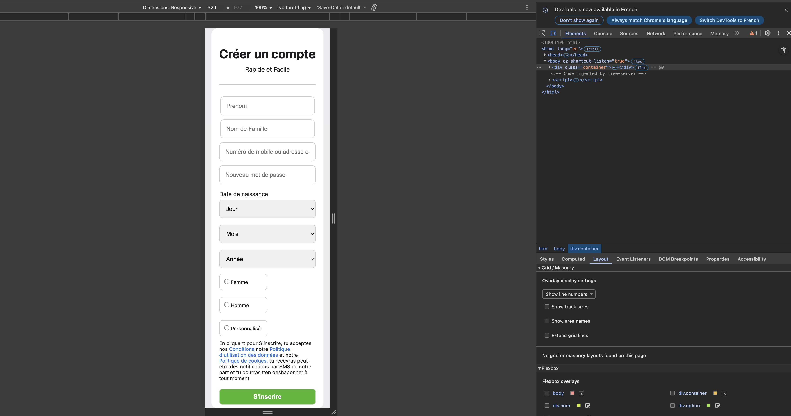
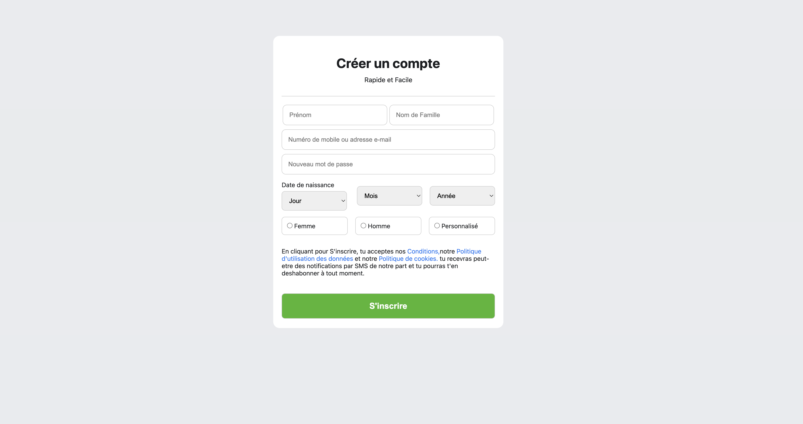

# Formulaire d'inscription

##  Description
Ce projet est une page de création de compte inspirée du style des formulaires modernes (comme Facebook).  
Il a été réalisé en HTML et CSS, avec une mise en page responsive qui s’adapte à tous les écrans (ordinateurs, tablettes et téléphones).

## Fonctionnalités
- Champs pour le prénom, nom, e-mail et mot de passe  
- Sélecteurs de date de naissance (jour, mois, année)  
- Choix du genre (Femme, Homme, Personnalisé)  
- Message d’information et bouton d’inscription stylisé  
- Design clair, moderne et agréable à l’œil  

## Technologies utilisées
- HTML5
- CSS

